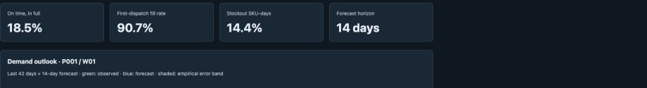
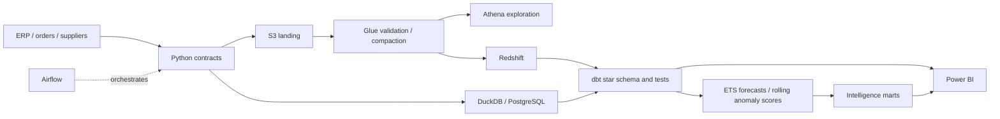

# Supply Chain Analytics Control Tower

[](https://github.com/nawyaunnam/supply-chain-analytics-control-tower/actions/workflows/ci.yml)

A runnable supply-chain analytics portfolio that connects **supplier reliability, order service, inventory health and demand outlook**. It combines validated Python ingestion, AWS lake/warehouse assets, Airflow orchestration, tested dbt marts, statistical forecasting, explainable anomaly detection and Power BI project source.

The local demo needs no cloud credentials. PostgreSQL is tested as a real warehouse target; DuckDB provides a fast local path. The AWS route uses S3 → Glue → Athena for exploration and Redshift → dbt for dimensional analytics. All published data is synthetic.



Actual capture of the HTML preview using synthetic data, not a Power BI Desktop screenshot. [Open the complete preview locally](docs/demo/dashboard.html).

A delivery can fill most units and still miss the customer's promise. The [order fact](dbt/models/marts/fct_order.sql) requires every non-cancelled line to arrive in full by its own promise date; the [metric tests](tests/test_metrics.py) cover split and late shipments. This keeps order OTIF separate from unit-weighted fill rate.



## Run the demo

```bash
git clone https://github.com/nawyaunnam/supply-chain-analytics-control-tower.git
cd supply-chain-analytics-control-tower
python3.12 -m venv .venv
source .venv/bin/activate
pip install -e '.[dev]'
tower demo
python -m http.server 8082 --directory artifacts
```

Open **http://localhost:8082/dashboard.html**. Docker alternative: `docker compose up --build pipeline preview`. See [deployment](docs/deployment.md) for PostgreSQL, Airflow, real ERP JSON exports and AWS setup.

Default synthetic run: **240 days, 8 SKUs, 3 warehouses, 4 suppliers, 3,732 non-cancelled order lines and 4,460 shipments**. It produces **336 future predictions, 2,016 backtest rows and 660 statistical alerts**. The fixture intentionally contains stock pressure and delivery delays: these are not real company performance claims. [Sample results](docs/demo/summary.json) · [Download/open the HTML preview](docs/demo/dashboard.html).

## Business questions

| Area | Analysis |
|---|---|
| Service | Order-level OTIF, first-dispatch fill rate, overdue incomplete orders |
| Inventory | Daily balances, turnover, stockout SKU-days, safety-stock breaches, persistent stockout streaks |
| Suppliers | Due-PO OTIF, receipt lead time, signed lateness, lead-time variability, overdue receipts |
| Transport | Shipment cost, cost per unit, carrier transit time and variance |
| Forecasting | Seasonal-naive vs damped ETS; 14-day forecasts, rolling-origin WAPE/MAE/bias |
| Anomalies | Trailing-median/MAD alerts for demand, inventory changes and delivery behavior |

[Metric contracts](docs/metrics.md) define grains, denominators and observation windows. The golden case demonstrates why averaging line OTIF is wrong: a split late delivery fails the whole order. Stock-flow tests reconcile shipments to inventory movements.

## Power BI project

[powerbi/ControlTower.pbip](powerbi/ControlTower.pbip) includes six pages, **30 explicit DAX measures**, typed Power Query/M CSV and Redshift connections, separate operational facts, warehouse RLS and warehouse drill-through. Pages cover executive service, inventory, suppliers, forecasting and anomalies.

[Power BI instructions](powerbi/README.md) explain model relationships and acceptance checks. CI validates report JSON against Microsoft's schemas and parses the semantic model with Microsoft TOM. **Power BI Desktop rendering, DAX-engine execution and Service RLS still require Windows/cloud validation.** No `.pbix` binary or fabricated Desktop screenshot is claimed.

## Engineering highlights

- Deterministic daily stock-flow simulation: dispatched units cannot exceed physical stock.
- Strict source contracts, natural-key uniqueness, foreign keys, chronology and overshipment guards.
- Immutable Parquet batches with SHA256 manifests and transactionally replaced raw snapshots.
- dbt dimensions, facts and marts with inventory, shipment, grain, service and forecast assertions.
- Forecast selection uses only data available before each origin; prediction bands are explicitly labeled empirical.
- Airflow retries, task timeouts, serialized runs and isolated dependencies.
- Glue/Spark transformation code, batch-versioned catalog databases, encrypted S3, Athena scan limits and Redshift COPY staging.
- CI jobs for Python/dbt, PostgreSQL, Docker/Airflow, Glue/Spark and Power BI metadata.

## Verify

```bash
ruff check src tests glue dags
pytest -q
tower demo
```

The Spark-specific test is skipped in a normal local environment and runs in the dedicated CI job with Spark 3.5.4. CI publishes `analytics-evidence`: dashboard, CSVs, metric summary, dbt manifest and run results. Analyst SQL investigations are in [sql/](sql/).

## Layout

```text
src/control_tower/  contracts, simulation, ingestion, warehouses, forecasting, export
dbt/                source views, dimensions, facts, service and intelligence marts
dags/               Airflow dependency chain
glue/               Spark validation, compaction and catalog registration
aws/                CloudFormation and Athena exploration SQL
powerbi/            PBIP / PBIR / semantic model / readable DAX
tests/              golden business cases, leakage tests, schemas and model parser
docs/               metric contracts, forecasting limitations, deployment, sample preview
```

## Scope and limits

This is a working portfolio reference, not a claim of production deployment. Live ERP connectors are not included; import seven contracted JSON exports. AWS resources require your credentials and have not been deployed. Full snapshot rebuilding handles corrections in this bounded dataset; production CDC/SCD history and incremental refresh need additional design. Replenishment risk does not net inbound supply and never places orders. Alerts are review candidates, not validated incidents. [Forecast methodology and limitations](docs/forecasting.md).

MIT licensed. Microsoft report schemas retain their original license.
